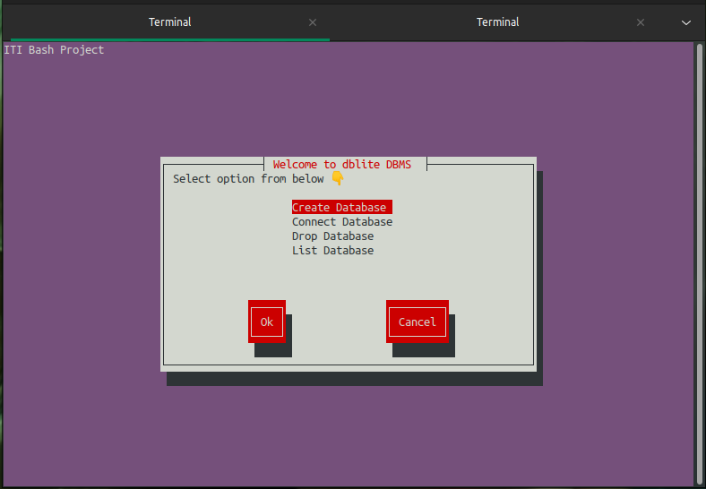
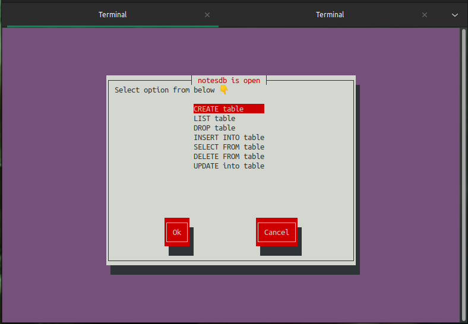
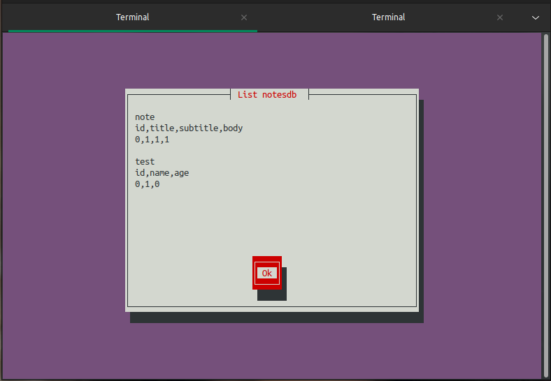
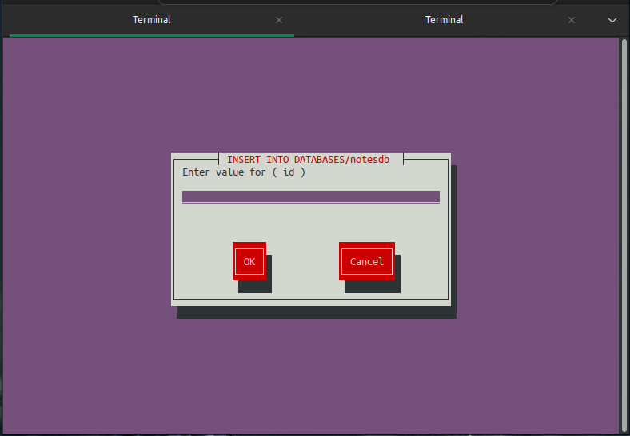
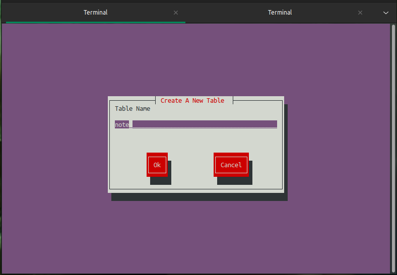
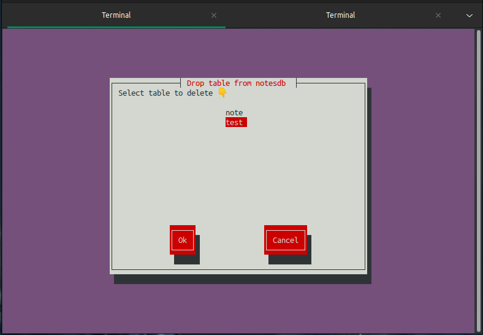

# DBLite
DBLite is database management system implemented in bash.
## Usage

### Run setup.sh script for initial setup
```shell
$. setup.sh
```

### start using
```shell
$dblite.sh
```


## Screenshot of dblite terminal UI

<p >
  
   
</p>

<p >
  
   
</p>

<p >
  
   
</p>
